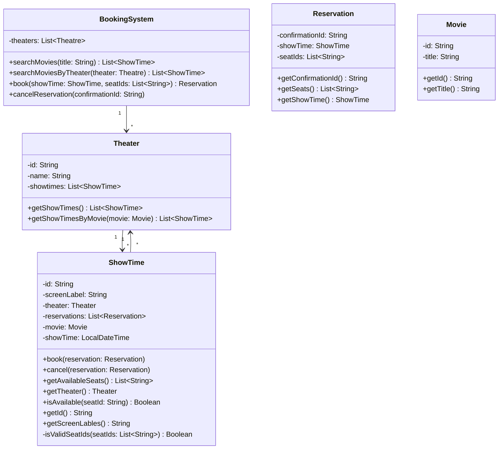

## Requirements

#### Design a movie booking system like book my show

## Core Features

- User will be able to search movies based on title
- User will be able to see what movies are running in a theater
- Theaters will have multiple screens each screen will have same layout [ Row: A- Z  and col: 0 - 26 ]
- user can be able to see available seats and can book those
- User can book multiple seats 
- When tickets get booked user will receive the confirmation of their reservation with an Id and the seat details
- two users can go for booking the same seat but only of them should succeed
- Users can cancel their reservations and those seats will be available for booking

## Out Of Scope

- UI/UX flow
- Payment Integration
- Variable Seat Layouts

## Class Diagram

